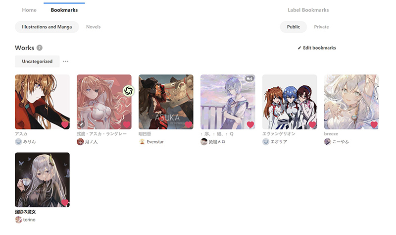
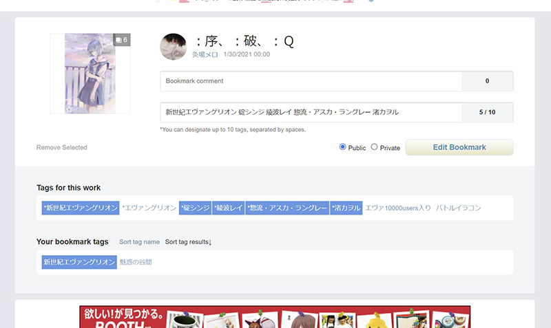
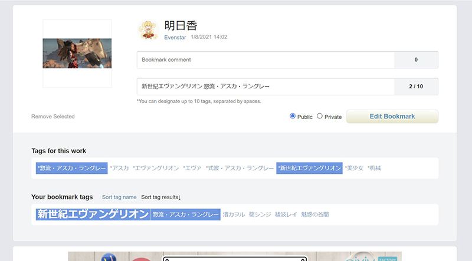
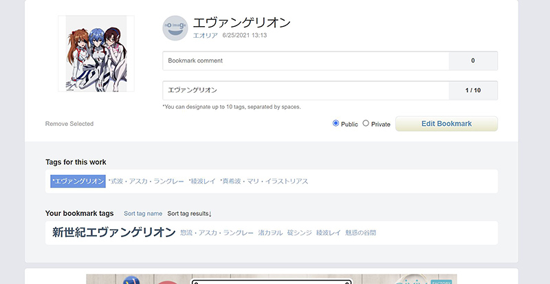
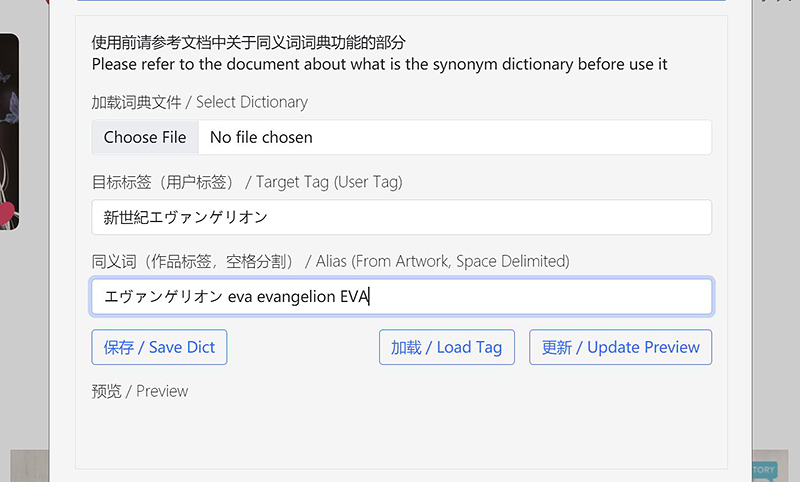
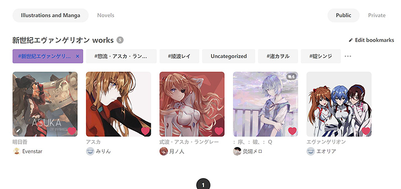
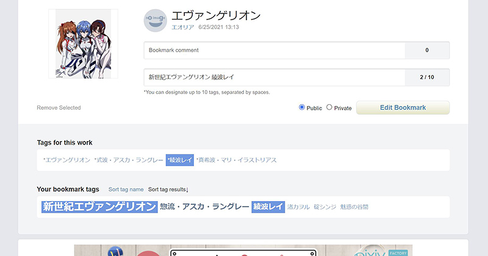

# Label Pixiv Bookmarks

<a href="#cn_doc">中文文档</a>

## Automatically add existing labels for images in the bookmarks

## Intro

- The script will compare **your existing bookmark tags** and tags of the image, then find the intersection and save

- If there is no match, the first tag of the image will be added (configurable now)

- It is implemented by Pixiv Web APIs, and they would be outdated someday. Please start an issue at Github.

## Usage

- It is suggested that users may add several custom bookmark tags before using the script. Or you may want to use the "add the first tag" function for cold start

- Users could find the "Label Bookmarks" button on their dashboard or bookmark page

- The script is now configurable. Here are some explanations:

- Whether the first tag will be added if there is not any match
  - If you do not have labeled any artworks, it is recommended to choose "Yes"
  - It works when the intersection of your existing bookmark tags and tags of the work is empty, then the first tag of the image will be added
  - It is designed for a cold start. If you want to leave some of them uncategorized, choose No instead
  
- Whether the "SAFE" tag will be added to non-R18 works:
  - It is obvious that this function is for figuring out those SFW images
  - Choose Yes if you want the SAFE tag
  
- Auto Labeling For
  - By default, the script does label for those uncategorized works
  - You may want to re-label all your favorite artworks when some newly-added labels were not applied to those former images
  - Choose "All Works" in this case
  - You are free to assign a specific tag for labeling. Note that the tag is usually a Japanese word.
  
- Whether the bookmark comment will be retained?
  - On the edit bookmark page it is allowed to add some comments for this bookmark
  - By default, the comment is ignored. If you have used this comment function before, you can still retain it by choosing "Yes"
  - Fetching those comments will take extra efforts and may reduce the performance
  
- Whether the previous custom bookmark tags will be retained?
  - The custom bookmark tag means those tags not provided by the author. Since the script will take the intersection of your tags and tags of the image, your custom tags will be overwritten.
  - Choose "Yes" if you want to keep them. This option needs extra request to the pixiv server and will take more time.
  - There is another way to keep them, that is to use a synonym dictionary. You may refer to the next section about it.
  
- Publication Type for Labeling
  - Pixiv stores public and private bookmarks in different places, and they have independent tags
  - By default, the script only does label for public bookmarks

## For First-time User

- This is a new account with all images uncategorized. Let's start from here.
  

- As aforementioned, it is required to have some tags of your own before using the script (as shown in the *Your bookmark tags* section). We choose some tags from *Tags for this work* and save it the by clicking *Edit Bookmark*.
  

- The next time we visit this page with another image, you will find that *Your bookmark tags* have been updated. There are some matching tags in the two section, and this script will do this work in batches. 
- If you don't want to start from collecting tags manually, it is recommended to use the first option *Add the first tag if there is no match*. After collecting enough tags, you can stop the program at any time.
  

## Synonym Dictionary

- Sometimes the author does not provide the so-called *official* tag for the artwork. This inconsistent makes it hard for us to do automatic labeling. If we have a synonym dictionary that have all synonyms, or aliases for a tag, the result could be more neat.

- In this version I implemented a synonym dictionary. For the first time we use it, skip the *Load Dictionary* option. The target tag, or user tag is the one you want it in your bookmark. The aliases are those tags you want the script to recognize as the target tag. 

- Click the ***Update Preview*** to register this rule, and it will display at the preview zone below. Leave the alias blank and click update could remove the rule from the dictionary.

- Don't forget to ***SAVE*** your dictionary to your local disk before leaving.

- The next time using the script, you need to ***LOAD*** the dictionary file before start, or your synonym rules will not be applied.

- After executed the script, all images with either the user tag, or the alias tag have been categorized to your user tag.

- There are a lot of things you can do with this functionality. For example, most character in pixiv use the katakana (片仮名) as its official name, which makes the non-Japanese speakers hard to recognize the name.

- Take Soryu Asuka Langley as an instance. She has at least four kinds of appellations like 惣流・アスカ・ラングレー/式波・アスカ・ラングレー/そうりゅう・アスカ・ラングレー/しきなみ・アスカ・ラングレー. Now we can set Soryu_Asuka_Langley as the target tag, and those Japanese names as the alias.

- Don't forget the underscore. Pixiv uses space as the delimiter so Soryu Asuka Langley will be recognized as three tags.

- Something more about the synonym dictionary:

- Is it possible to save/load the dictionary automatically?
  - As far as I know this is prohibited by the browser, because it will be dangerous to allow the webpage to have access to your local files. There are great chances that your computer will be vulnerable to trojan horses and other viruses.
  - Another way to do that is to store your dictionary in a server, and fetch it when necessary. Unfortunately this script is quite simple, and I do not have a free server now. Maybe in the future I will make it.
  
- My computer warns me the dictionary file is not secure.
  - The file is generated by the browser and seems lack something I don't know yet to pass the security check. It is open-sourced, and you are free to check the code. It will be much helping if you can help me fix it!
  
- Could I edit the dictionary file myself?
  - Yes. The structure is quite simple, and use JSON to store the values. If you are not familiar to this file type, there are a lot of online editors that help your to modify the content.

## FAQ

- The "Label Bookmarks" button cannot be found on the website
  - Firstly make sure that you are at the correct place, and try to **refresh** before the next step
    - The new version of Pixiv UI uses React to update the page without refreshing, so the button might not be loaded
  - Generally, the path should be like https://www.pixiv.net/users/{YOUR UID}/bookmarks/artworks or https://www.pixiv.net/bookmark.php
  - If the path is fine, and the button is still lost, it is probably because Pixiv updates its UI. Inform me at Github by starting an issue

- The script cannot work and alert a prompt
  - Please take down the prompt and start an issue at Github. The problem can be specific

- In bookmark page of old version UI, the title of images become extremely large
  - In the old version UI the title of images use h1 tag to present, which is completely ignorant of accessibility and conflicts with the bootstrap css that used to style the page
  - I have tried to restore the font size of some titles. But for those images load asynchronously (like recommended images), there is very little that I can do for now.

- Whether Pixiv will ban my account for the script
  - The script is basically for self-use, and I have limited the speed of sending requests. It works properly on thousands of images.

## Copyright and contact

MIT license will be used for this script.

The idea of the script and part of the code comes from `https://greasyfork.org/en/users/150919-lyushiwang`, which is outdated and without maintenance.

Please report bugs or new features expected at [Github](https://github.com/Ziqing19/LabelPixivBookmarks).

<h1 id="cn_doc">自动为Pixiv收藏夹内图片打上已有的标签</h1>

## 工作原理

- 脚本会比对作品自带的标签，以及**用户已收藏的标签**，然后为作品打上匹配的标签

- 如果已收藏标签与作品自带标签没有交集，将会自动添加第一个标签（可配置）

- 本脚本使用Pixiv的网页API进行操作，可能会出现API过时等情况，如果出现错误请在Github提交issue

## 使用说明

- 在使用脚本前，推荐提前收藏一些标签用于分类。或者可以使用自动添加首个标签功能完成冷启动

- 开启脚本后，进入个人主页/收藏后找到“自动添加标签”按钮

- 可以对脚本进行配置，下面进行简单的说明：

- 无匹配时是否自动添加首个标签
  - 如果用户之前没有为收藏的作品添加过标签，建议选“是”
  - 作用为当该作品的标签与已收藏的标签**没有交集**时，默认添加该作品的第一个标签
- 是否为非R18作品自动添加"SAFE"标签
  + 如字面意思，如果需要挑出全年龄向内容的作品，建议选“是”
- 自动标签范围
  - 脚本的工作范围，默认为对“未分类作品”进行自动标签
  - 如果要自定义标签，请确保标签的名称输入正确（通常为日文标签，推荐直接从网页上复制）
- 是否保留收藏评论
  - 参见编辑收藏的详情页，pixiv允许用户对收藏的作品进行备注评论
  - 默认为舍弃，如果您使用过收藏评论功能，请选择“保留”（需要额外的获取评论详情的操作，可能会降低性能）
- 是否保留之前的自定义标签
  - 自定义标签指并非由作者提供，而是您自己创建的标签。如上文所述，本脚本会在作品的标签和您自己的标签中找到匹配的标签然后提交。因此如果选择舍弃，用户自己创建的标签将会被覆盖。选择保留将会需要向服务器提交额外的请求，因此可能降低性能
  - 如果一直使用此脚本管理标签，则没有影响
  - 另外一种解决方式是，使用下面会详述的***同义词词典***功能
- 作品公开类型
  - pixiv的公开和非公开作品使用两套不同的收藏体系，标签列表也是独立的
  - 默认为对公开收藏的作品进行自动标签

## 第一次使用的用户

- 这是一个收藏了部分图片，但是所有的图片都是未分类状态的新账户
  

- 如前文所述，在使用脚本前需要您自己收藏过一些标签（如下图中下方区域所示）。我们从中间区域，作者提供的标签池中选择一部分，点击保存

- 当下一次编辑其他图片的标签时，我们刚才选中的标签这次已经出现在了下方区域中。我们发现两个区域中有不少重合的标签，选中后会有背景色。这个脚本就是可以为我们批量进行这样的选择，并且提交给Pixiv
- 如果您不希望从全手动选择开始，也可以使用第一个选项的***无匹配时自动添加首个标签***，在收集了足够的标签后，手动停止脚本再继续运行

### 同义词词典

- 有些时候作者并没有为作品或人物提供所谓的***官方名称***，这就导致自动识别变得困难。如果我们使用一个同义词词典储存一个标签的全部同义词——或者叫别名，那么分类的结果将会更加整洁

- 在这个版本中我提供了可以加载同义词词典的选项。第一次使用时可以略过***加载词典文件***的选项。目标标签，指的是您希望保存在您收藏夹中的用户标签的名字。同义词则是那些您希望脚本将其识别为目标标签的作品本身提供的标签
- 点击***更新标签***将输入的内容加载到词典中，然后将会在下方的预览区域展示出来。如果您在同义词一栏空白的情况下更新，将会把目标标签从词典中删除
- 在制作完词典后，请一定记得***保存***您的词典到本地
- 下次使用时，您需要从本地加载上次使用过的词典，否则设定的同义词规则不会被应用到这次的分类中
  

- 执行完脚本后，无论是含有目标标签，还是同义词标签的图片都被分类到了目标标签下

- 利用此功能可以实现很多事情。例如Pixiv大部分角色都是用片假名作为官方名称，这对非日语母语的人来说识别起来非常痛苦。拿明日香做例子，明日香至少有4种常用称呼：惣流・アスカ・ラングレー/式波・アスカ・ラングレー/そうりゅう・アスカ・ラングレー/しきなみ・アスカ・ラングレー。我们现在就可以使用简单的***明日香***作为目标标签，将上述都做为同义词标签储存。

- 注意自定义的目标标签中不能有空格，因为Pixiv使用空格作为标签间的分隔符

- 除此以外的一些问题：

- 是否能够自动载入/储存同义词词典
  - 据我所知，对本地文件的后台读写是被浏览器禁止的行为。因为这会导致电脑容易受到木马和病毒的攻击
  - 除此以外使用服务器储存，在使用时从服务器取回词典数据也是一种手段。但这个脚本比较简单，我手上目前也没有可以用作私人用途的服务器，可能之后会提供上传到服务器的选项
  
- 电脑提示下载的词典文件有安全问题
  - 词典文件由浏览器生成，可能缺少一些我不太清楚的安全签名之类。因为是开源脚本，如果不放心可以检查一遍。如果能帮我解决掉这个问题更好了（

- 我自己能编辑这个文件吗？
  - 词典用JSON格式储存，结构非常简单。如果不熟悉JSON格式，网上有很多在线编辑器可以使用，脚本只提供了最基本的增删改的功能

## 常见问题

- 网页上找不到“自动添加标签”按钮
  - 请确认当前是否在个人主页或收藏夹页，网址通常为https://www.pixiv.net/users/{用户UID}/bookmarks/artworks或https://www.pixiv.net/bookmark.php
  - **尝试刷新网页**
    - 新版UI使用React在不重新加载的情况下更新页面内容，导致按钮可能没有被加载
  - 如果当前路径无误，刷新后依然无法找到按钮，可能为Pixiv更新了网页UI，请于Github提交issue

- 无法正常运行，弹窗提示错误
  - 请记录下弹窗提示内容，并在Github提交issue，通常具体问题需要具体分析

- 旧版UI会导致部分字体变大
  - 旧版UI在作品标题使用了h1标签（非常离谱），而本脚本使用bootstrap进行排版，导致样式冲突
  - 目前只对已经加载的部分恢复了字体大小，对于异步加载的推荐栏无法生效

- 使用该脚本是否会导致封号？
  - 该脚本为作者方便分类的自用脚本，并且限制了提交速度，在千数量级的工作量下暂时没有出现问题

## 版权与联络方式

本脚本使用MIT许可证，思路与部分代码来自`https://greasyfork.org/en/users/150919-lyushiwang`，因为上述项目暂停维护无法使用因此进行更新。Bug与新功能需求请在[Github](https://github.com/Ziqing19/LabelPixivBookmarks)进行提交。