# Label Pixiv Bookmarks

<a href="#cn_doc">中文文档</a>

## Automatically add existing tags for images in the bookmarks, and search them

## Please Use Tampermonkey as the script manager

- The script is developed on Tampermonkey, whereas Greasemonkey has quite different API calls.

## Intro

- The script will compare **your existing bookmark tags** and tags of the image, then find the intersection and save

- If there is no intersection, the script will skip the image. Or you can configure the script to add the first tag of the image by default.

- You might also search your bookmarks by your custom tag

- The script is implemented by Pixiv Web APIs. Please open a new issue at GitHub if it was outdated.

## For First-time User

- This is a new account with all bookmarked images uncategorized. Let's start from here.
  
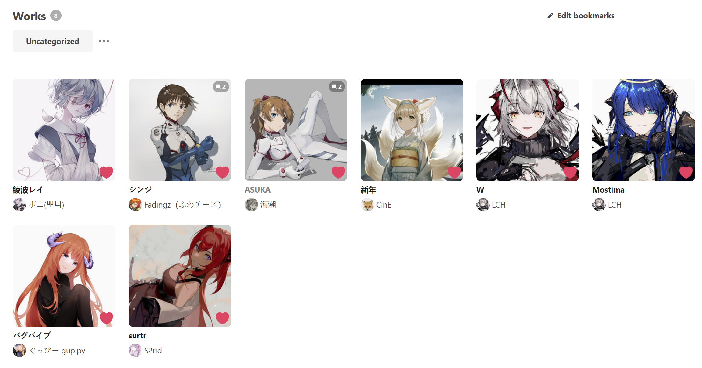

- There are several ways to build up your bookmarked tags pool from scratch before using the script

1. In the bookmarks page, hovering on the thumbnail and clicking the ***Edit tags*** button. you will find the ***Creat a tag*** button in the dialog. After saving all your changes, those created tags will be saved to your bookmarked tags.

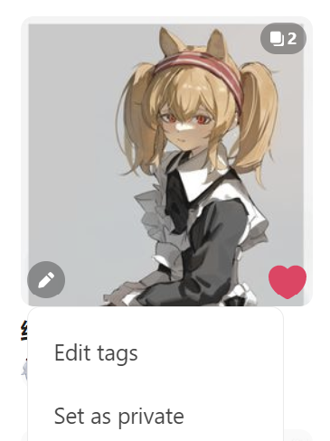

2. In the bookmark detail page, you can choose some tags from ***Tags for this work***, and then click ***Edit Bookmark*** to save
  
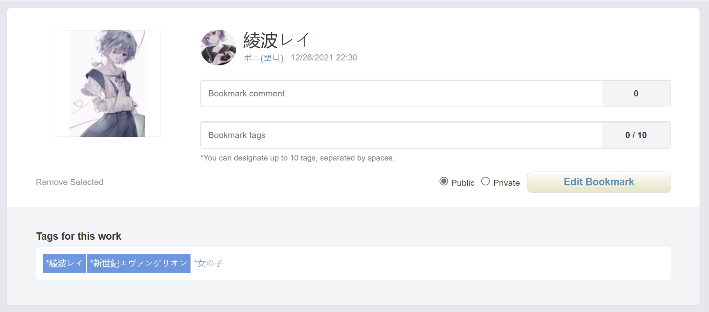

3. Let the script grabs the first tag from the work to build up your bookmarked tags pool. In this case you should make sure that in the advanced settings of the script ***add the first tag*** option is set to ***Yes***. You are free to remove those unwanted tags later, and don't forget to reset the value to ***No*** after you tags pool has been settled.

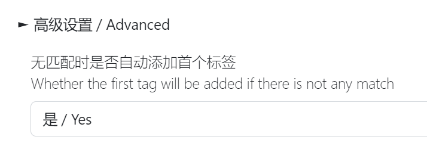

4. Use the synonym dictionary of the script. All the ***user tags*** (i.e. the target tag) will be added to your bookmarked tags pool. See below to find out how to use the synonym dict. 

## Start Labeling

- In the Bookmarks Page, click ***Label*** button to open the script page
- For first time user, if you already have some bookmarked tags, just click ***Start*** to run
- Or you might need to add some tags to your pool as aforementioned
- Assume that we already have the tag [新世紀エヴァンゲリオン] being bookmarked
  
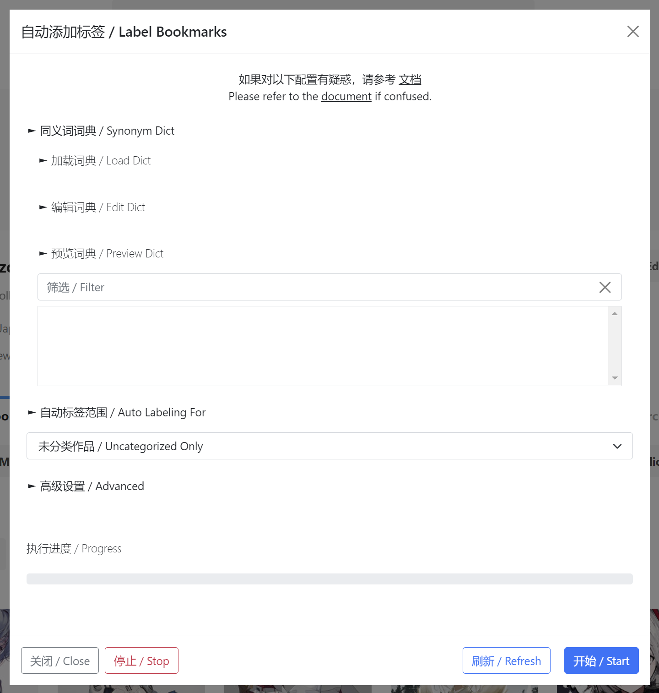

- Wait for the progress bar until it reaches the end.
- Refresh the page, and we will find that all images with the tag [新世紀エヴァンゲリオン] have been categorized

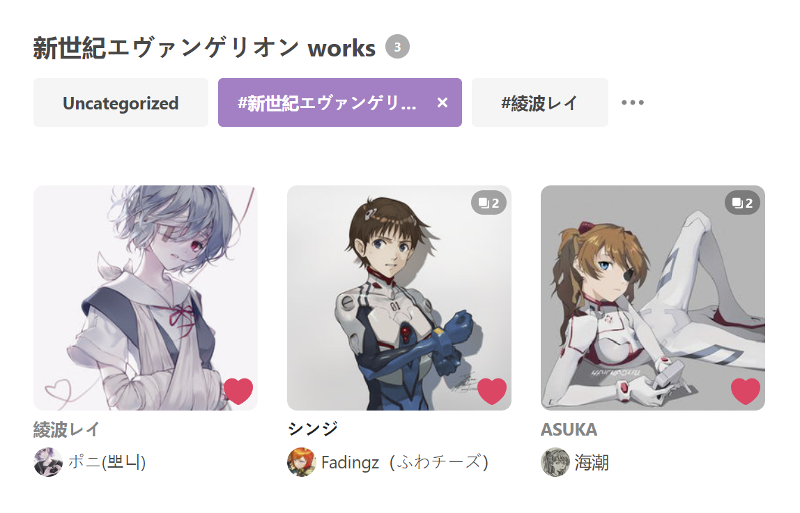

## Synonym Dictionary

- Sometimes the author does not provide the so-called *official* tag for the artwork. This inconsistency makes it hard for us to do labeling. 
- Here we introduce the synonym dictionary that stores tag-alias pairs. All alias for a tag will be regarded as the same as the tag itself.
- For example, the tags of the image contains [EVA] instead of [新世紀エヴァンゲリオン], so that it won't be categorized into [新世紀エヴァンゲリオン].

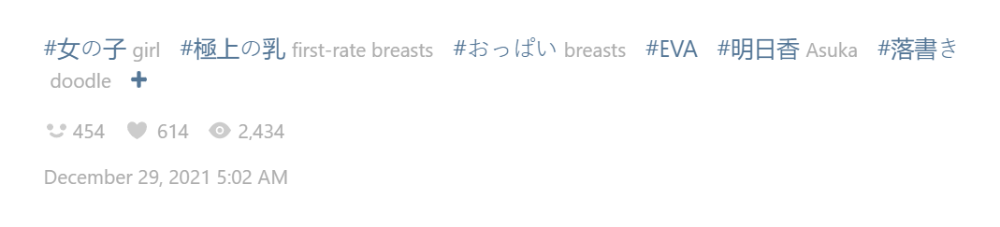

- Open the script page and we wil find the ***Edit Dict*** button.
- The ***Target Tag*** is the one that you want it in your bookmark tags pool (eg: 新世紀エヴァンゲリオン); and the ***Alias*** are the tags that you want them to be regarded as the target tag (eg: eva, evangelion).
- Note that all alias should be delimited by spaces, or line breakers
- Click ***Update Tag*** to save the user tag and alias into the dictionary. If the alias is empty the user tag will be removed
- You can export the dictionary to local disk as a backup
- To modify the alias, enter the user tag value and click ***Load Tag*** to load the alias value from the dict (or use tab key), and click ***Update Tag*** to save

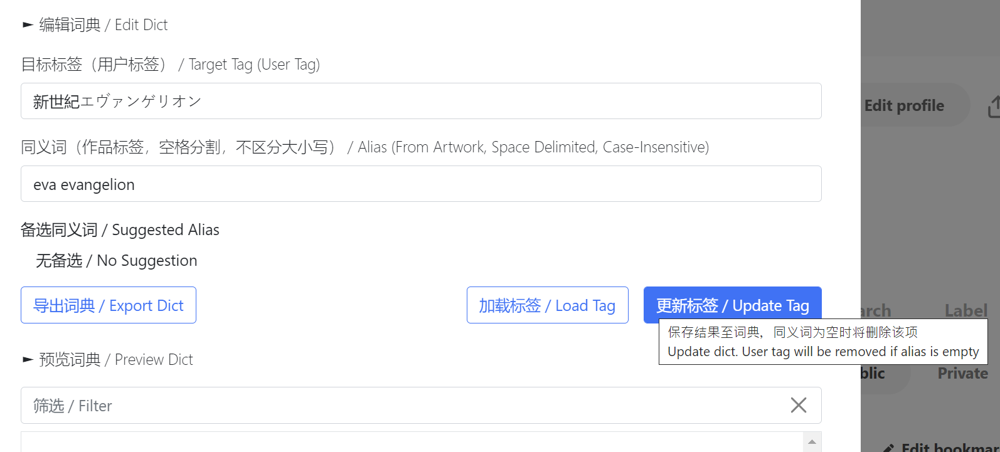

- After executing the script again, all uncategorized images with either the target tag, or the alias tag now have been categorized to your target tag.

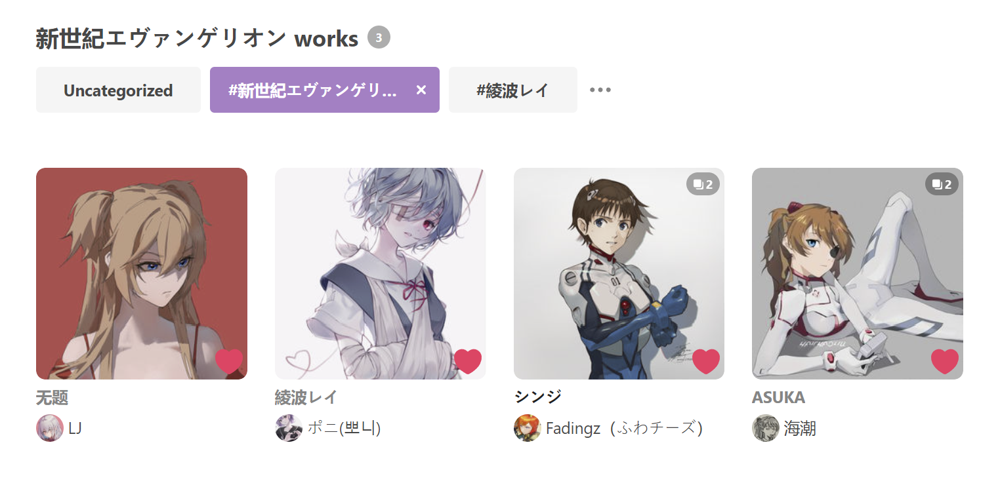

- There are a lot of things you can do with this functionality. For example, most character in pixiv use the katakana (片仮名) as its official name, which makes the non-Japanese speakers hard to recognize the name.

- Take Soryu Asuka Langley as an instance. She has at least four kinds of appellations like 惣流・アスカ・ラングレー/式波・アスカ・ラングレー/そうりゅう・アスカ・ラングレー/しきなみ・アスカ・ラングレー. Now we can set ***asuka*** as the target tag, and those Japanese names as the alias.

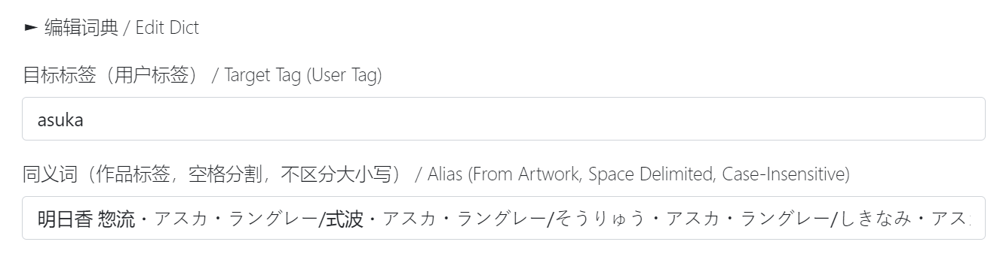

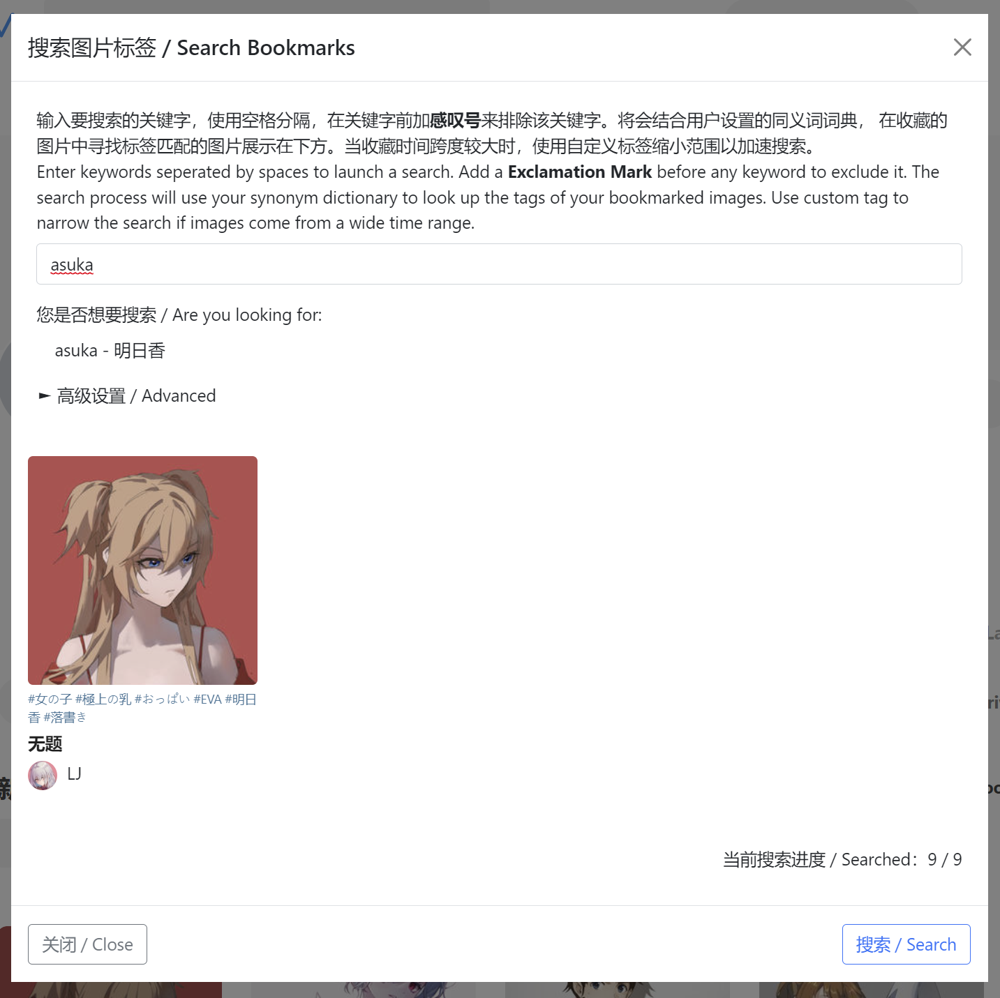
  
## Examples

- Here are the example of my own synonym dictionary and user tags. You might refer it to set yours.

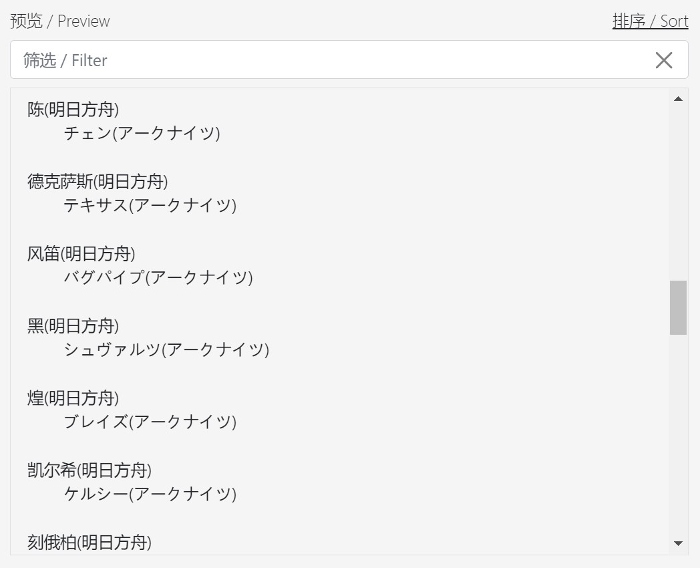
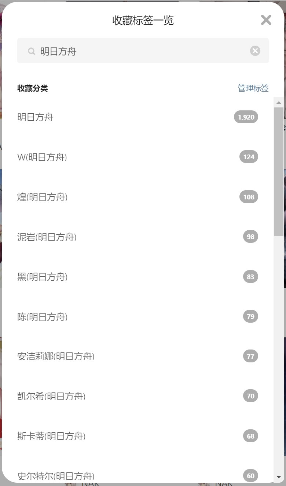

## About Some Advanced Settings

- Auto Labeling For
  - By default, the script does label for those uncategorized images
  - You may want to re-label all your favorite artworks when some newly-added tags were not applied to those former images.
  - For example, if you just add [ayanami_rei] to your user tags, you can choose [新世紀エヴァンゲリオン] and re-run the script. Therefore, all images with [新世紀エヴァンゲリオン] tag will be searched and labeled again.
 
- Whether the first tag will be added if there is not any match
  - Design for a cold start
  - It works when the intersection of your existing bookmark tags and tags of the work is empty, then the first tag of the image will be added

- Publication Type for Labeling
  - Pixiv stores public and private bookmarks in different places, and they have independent tags
  - By default, the script only does label for public bookmarks

- Whether NSFW works will be labeled as #R-18?
  - By default, the script will categorize those NSFW works into the R-18 tag
  - If you don't want the tag, set it as *No* before starting

## Remove All Tags from Selected Works

- The script can help you remove all tags from selected artworks easily
- This usually helps when you want to reset multiple images to Uncategorized
- Click on the ***Edit Bookmarks*** button, and you will find an extra ***Remove Tags*** button below the tags section
- The button is disabled until you select several images

## Remove a Bookmark Tag from Related Works
 
- It is not hard for you to find that a new button named ***Delete Tag XXX*** comes out when you click on the Edit Bookmarks button
- This will help you to remove this bookmark tag from ***ALL*** related images
- This operation will not affect the bookmarked status, i.e. the images will become uncategorized if there is not any other tag remains

## Search Your Bookmarks

- You can also search your bookmarks with this script
- Click ***Search*** Button to open the search page, and search with the keyword [asuka], which is the target tag we have registered before
- The script will return all images with tag [asuka] or [asuka]'s alias.
  
## FAQ

- The ***Label*** button cannot be found on the website
  - Firstly make sure that you are at the correct place, and try to **refresh** before the next step
    - The new version of Pixiv UI uses React to update the page without refreshing, so the button might not be loaded
  - Generally, the correct path should be like https://www.pixiv.net/users/{YOUR UID}/bookmarks/artworks or https://www.pixiv.net/bookmark.php
  - If the path is correct, and the button is still nowhere to find, it is probably because Pixiv updates its UI. Inform me at GitHub by opening an issue

- The script cannot work and alert a prompt
  - Please take down the prompt and open an issue at GitHub. The problem can be specific

- The synonym dictionary got lost accidentally
  - Expand ***Load Dict*** and click the restore button the download the backup. The file could be imported to restore your dictionary.
  - If you think it is a bug, open an issue.

- Whether Pixiv will ban my account for the script
  - The script is basically for self-use, and I have limited the speed of sending requests. It works properly on thousands of images.

## Copyright and contact

The script complies with the MIT license.

Please report bugs or new features expected at [GitHub](https://github.com/Ziqing19/LabelPixivBookmarks).

<h1 id="cn_doc">自动为Pixiv收藏夹内图片打上已有的标签</h1>

## 请使用Tampermonkey插件

- 脚本基于Tampermonkey开发，Greasemonkey的API与本脚本不兼容，如果希望在Greasemonkey上使用请自行修改使用的API

## 工作原理

- 脚本会比对作品自带的标签，以及***用户已收藏的标签***，然后为作品打上匹配的标签

- 如果已收藏标签与作品自带标签没有交集，将会跳过该作品（或可选地自动添加作品首个标签）

- 脚本提供搜索收藏夹功能，可以对标签和标题进行搜索

- 本脚本使用Pixiv的网页API进行操作，可能会出现API过时等情况，如果出现错误请在Github提交issue

## 第一次使用的用户

- 这是一个收藏了部分图片，但是所有的图片都是未分类状态的新账户
  

- 在使用脚本前，我们有数种方法可以添加*用户已收藏的标签*

1. 在收藏夹页，悬停在图片缩略图上并点击左下角的***编辑标签***按钮，在对话框中可以找到***添加标签***按钮。在保存设置之后，所有创建的标签将被加入用户已收藏标签。

2. 在作品收藏详情页，选择一些作品已有的标签，或手动输入需要的标签，保存结果

3. 使用脚本自动添加标签。需要在高级设置中选择***自动添加首个标签***并设置为***是***。随后可以随意移除不需要的标签，但之后使用时请记得将此设置重置为***否***来避免增加过多不需要的标签。

4. 使用脚本的同义词词典功能。词典中所有的目标标签（用户标签）将会被视为是用户已收藏的标签。关于词典的使用方法请见下文

## 开始使用

- 在管理收藏页面，点击【添加标签】打开脚本页面
- 如果在此前已经设置好用户收藏标签，直接点击开始即可使用
- 否则需要按前文所述选择一种方式来添加一些用户收藏标签
- 假设我们已经添加了【新世紀エヴァンゲリオン】标签

- 等待运行结束，刷新页面，可以看到所有未分类作品中带有【新世紀エヴァンゲリオン】标签的作品都被自动分类到该标签下

 

## 同义词词典

- 有些时候作者并没有为作品或人物提供所谓的***官方名称***，这就导致自动识别标签变得困难。如果我们使用一个同义词词典储存一个标签的全部同义词——或者叫别名，那么分类的结果将会更加整洁
- 例如此作品下有【eva】标签，但没有【新世紀エヴァンゲリオン】标签，因此不会被自动分类到【新世紀エヴァンゲリオン】标签下

- 在自动标签页面，点击***编辑词典***展开选项
- 目标标签，指的是您希望保存在您收藏夹中的用户标签的名字，例如：新世紀エヴァンゲリオン。同义词则是那些您希望脚本将其识别为目标标签的作品本身提供的标签，例如：EVA
- 所有的同义词之间使用空格或回车分隔
- 点击***更新标签***将输入的内容加载到词典中，然后将会在下方的预览区域展示出来。如果您在同义词一栏空白的情况下更新，将会把目标标签从词典中删除
- 在制作完词典后，可以导出词典到本地进行备份
- 下次使用时，会自动记忆上次使用的词典，也可以从本地导入新的词典
- ***加载标签***按钮用于从词典中载入标签对应的同义词，在***目标标签***一栏中输入标签名，点击***加载标签***即可，直接按Tab键也有同样的效果
  

- 再次点击开始。执行完脚本后，含有【EVA】标签的作品已经被分类到了【新世紀エヴァンゲリオン】下

- 利用此功能可以实现很多事情。例如Pixiv大部分角色都是用片假名作为官方名称，这对非日语母语的人来说识别起来非常痛苦。拿明日香做例子，明日香至少有4种常用称呼：惣流・アスカ・ラングレー/式波・アスカ・ラングレー/そうりゅう・アスカ・ラングレー/しきなみ・アスカ・ラングレー。我们现在就可以使用简单的***asuka***作为目标标签，将上述都做为同义词标签储存。
  - 注意自定义的目标标签中不能有空格，因为Pixiv使用空格作为标签间的分隔符

## 示例

- 下图为已经整理好的同义词词典，以及对应的用户收藏标签示例，可以作为参考

## 可选设置说明

- 以下为脚本提供的可选配置的说明

- 自动标签范围
  - 脚本的工作范围，默认为对【未分类作品】进行自动标签
  - 可以使用下拉框选择其他的标签范围，使用场景例如下：
  - 用户收藏标签中新增了角色【绫波丽】，此时可以选择【新世紀エヴァンゲリオン】标签重新运行脚本，这样【新世紀エヴァンゲリオン】标签下所有含有【绫波丽】的图片都将被打上标签

- 无匹配时是否自动添加首个标签
  - 用于没有任何***用户收藏标签***的账户进行冷启动
  - 作用为当该作品的标签与已收藏的标签***没有交集***时，默认添加该作品的第一个标签

- 作品公开类型
  - pixiv的公开和非公开作品使用两套不同的收藏体系，标签列表也是独立的
  - 默认为对公开收藏的作品进行自动标签
  
- 是否为非全年龄作品标记#R-18标签
  - 默认会将非全年龄向作品归入R-18标签
  - 如果不需要该标签可以设置为忽略
  
## 清除作品的所有标签

- 除了自动标签，这里还提供了能够批量清除作品标签的功能
- 通常在需要将复数作品重置为***未分类***状态时使用
- 点击***管理收藏***，在标签栏下方会显示一个新增的***清除标签***按钮
- 当在下方选择了复数作品后，点击按钮清除作品标签

## 从所有关联作品中删除特定标签

- 在点击***管理收藏***后，原位置会出现新的***删除标签 XXX***按钮
- 这一功能将会从关联的所有作品中移除该标签
- 这一操作并不会影响作品的收藏状态，该标签下的作品至多会被还原为未分类状态

## 搜索收藏夹标签

- 除了自动标签以外，本脚本还提供搜索收藏夹功能，便于更快地在大量的收藏找到需要的图片。
- 点击【搜索图片】打开搜索页，我们可以用刚刚设置的目标标签【asuka】进行搜索，脚本会搜索所有匹配同义词标签（此处为：明日香）的作品并返回。这样可以快速的从收藏夹中按照人物名或其他特征快速搜索到指定作品，而不需要继续细分该标签。
- 搜索收藏夹时的标签匹配模式
  - 模糊匹配：作品标签部分匹配搜索内容即可
  - 精确匹配：作品的某个标签与搜索内容相同

## 常见问题

- 网页上找不到“自动添加标签”按钮
  - 请确认当前是否在个人主页或收藏夹页，网址通常为https://www.pixiv.net/users/{用户UID}/bookmarks/artworks或https://www.pixiv.net/bookmark.php
  - ***尝试刷新网页***
    - 新版UI使用React在不重新加载的情况下更新页面内容，导致按钮可能没有被加载
  - 如果当前路径无误，刷新后依然无法找到按钮，可能为Pixiv更新了网页UI，请于Github提交issue

- 无法正常运行，弹窗提示错误
  - 请记录下弹窗提示内容，并在Github提交issue，通常具体问题需要具体分析

- 同义词词典意外丢失
  - 点击***加载词典***中的恢复按钮下载自动备份，备份可以直接再次导入脚本
  - 如果是bug导致的词典丢失，请在Github提交issue反馈

- 电脑提示下载的词典文件有安全问题
  - 词典文件由浏览器生成，可能缺少一些我不太清楚的安全签名之类。因为是开源脚本，如果不放心可以检查一遍。如果能帮我解决掉这个问题更好了（

- 我自己能编辑这个文件吗？
  - 词典用JSON格式储存，结构非常简单。如果不熟悉JSON格式，网上有很多在线编辑器可以使用，脚本只提供了最基本的增删改的功能

- 使用该脚本是否会导致封号？
  - 该脚本为作者方便分类的自用脚本，并且限制了提交速度，在千数量级的工作量下暂时没有出现问题

## 版权与联络方式

本脚本使用MIT许可证，Bug与新功能需求请在[Github](https://github.com/Ziqing19/LabelPixivBookmarks)进行提交。